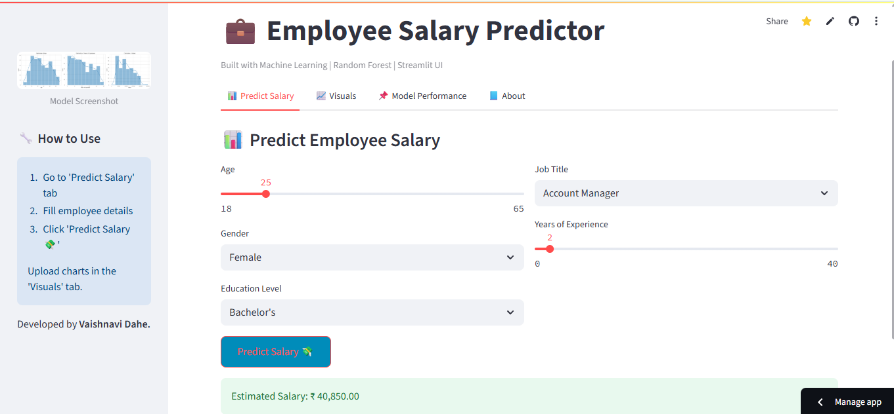
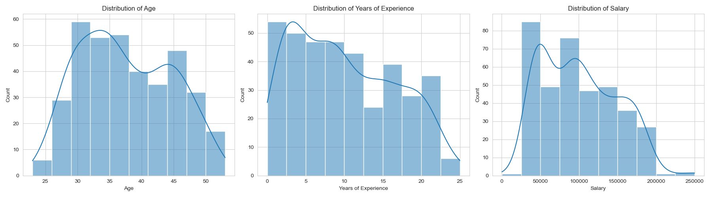

# 💼 Employee Salary Prediction App

A Machine Learning-powered web application built with **Streamlit** that predicts employee salaries based on input features like **Age**, **Gender**, **Education Level**, **Job Title**, and **Years of Experience**.

---

## 🚀 Live Demo

🔗https://employee-salary-predictor-mgnpoujdmxh9pmndg83d69.streamlit.app/ 

## 📌 Features

- Predict salary instantly using a trained Random Forest model
- User-friendly interface built with Streamlit
- Supports input for Age, Gender, Education, Job Title, and Experience
- Displays model performance metrics (MAE, MSE, R² Score)
- Visual charts for better insights
- Custom color theme and professional layout

---

## 📊 Input Features

- **Age**
- **Gender**
- **Education Level**
- **Job Title**
- **Years of Experience**

---

## 🧠 Machine Learning Models Used

- **Random Forest Regressor** (Main model)
- *(You can also mention others here if you added more)*

The model was trained using historical employee data and serialized using `joblib`.

---

## 📷 Screenshots

### 🔍 Prediction Page

### 📈 Model Performance

---

## 🛠️ Tech Stack

- **Frontend**: Streamlit
- **Backend**: Python
- **Machine Learning**: scikit-learn
- **Visualization**: Matplotlib, Plotly, Altair
- **Other Libraries**: Pandas, NumPy, joblib, streamlit-option-menu

---

## 📂 Project Structure
salary-prediction-app/
├── README.md                     
├── requirements.txt              
├── Salary Data.csv              
├── salary_model.py                
├── model_analysis.ipynb          
├── le_gender.pkl                
├── le_edu.pkl                   
├── le_job.pkl                    
├── app.py                              
├── assets/                     
│   ├── AgeVsSalary.png
│   ├── education.png

---

## 📦 Installation

### Clone the Repository
git clone (https://github.com/Vaishnavi592/Employee-Salary-Predictor)
cd Employee-Salary-Predictor

Install Dependencies
pip install -r requirements.txt

▶️ Run the App
streamlit run app.py

🌐 Deployment
This app is deployed using Streamlit Cloud.

🙋‍♀️ Author
Vaishnavi Dahe
MSc Computer Science Student
Passionate about Machine Learning and Web Apps
🌐 LinkedIn 
https://www.linkedin.com/in/vaishnavi-dahe-30b668227

